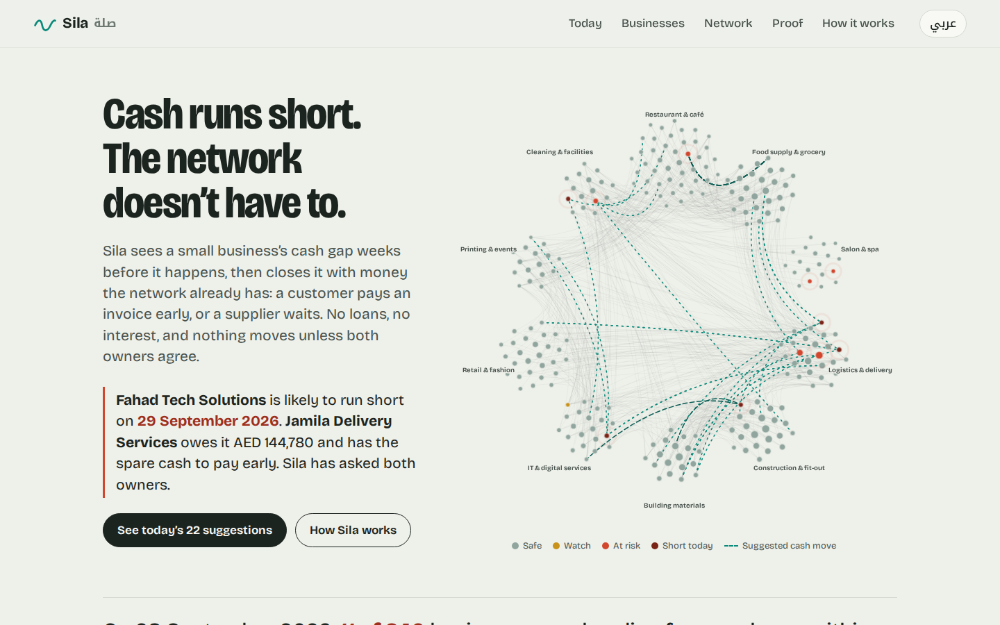
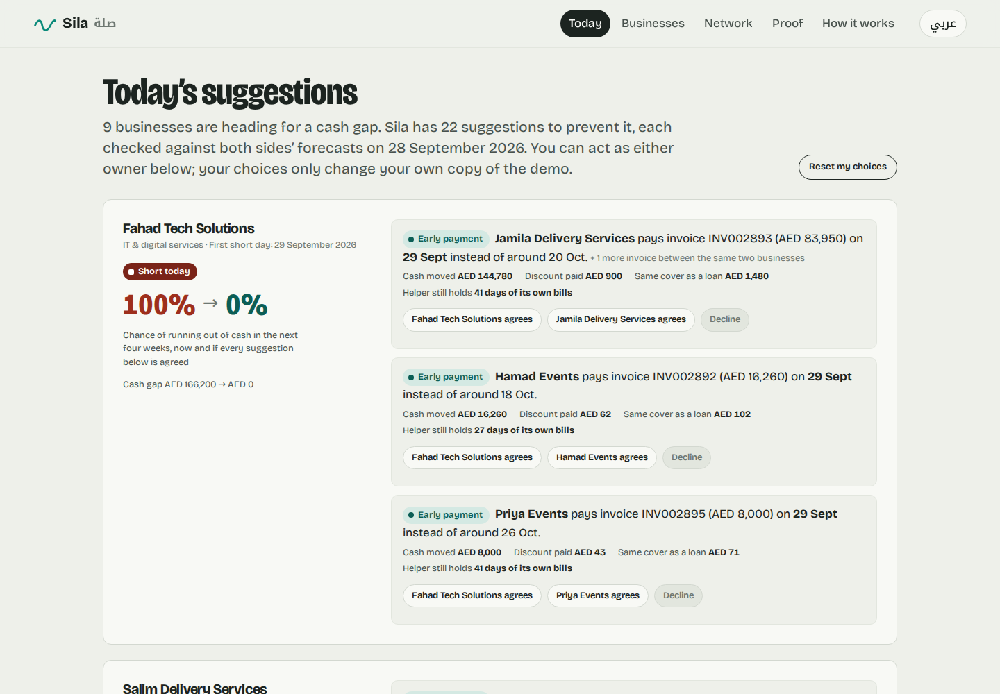
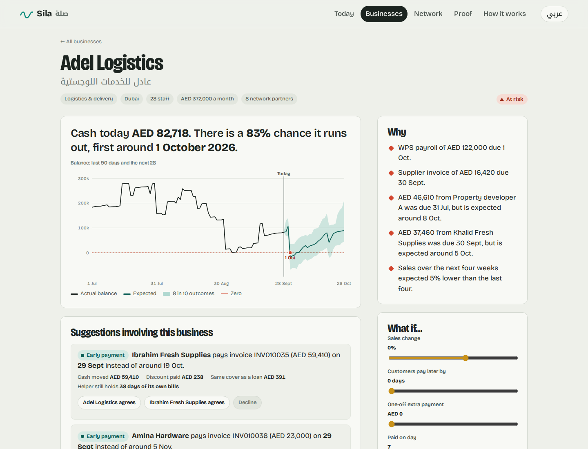
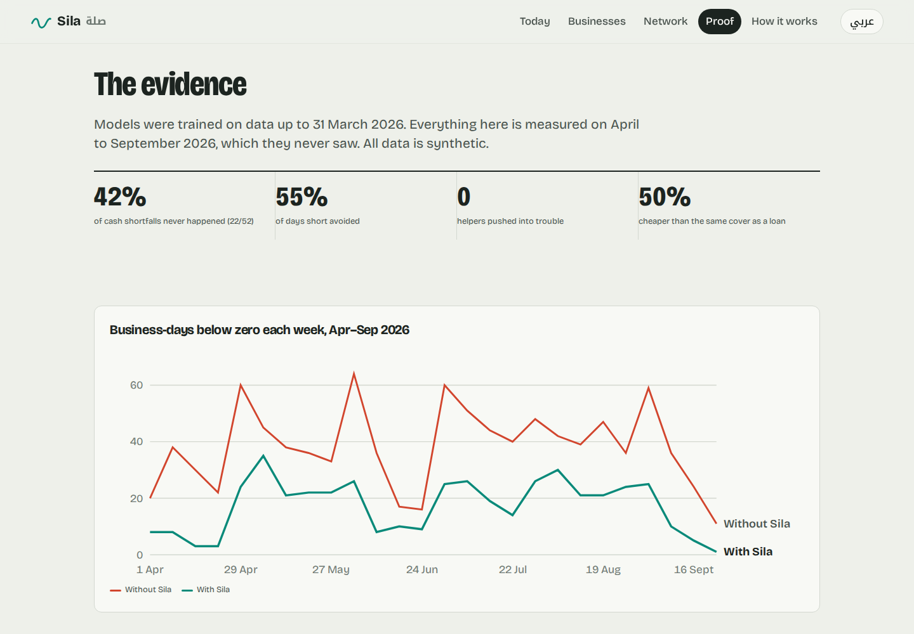
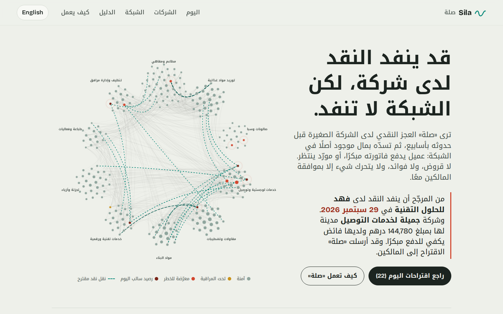

# 🌊 Sila — SME Liquidity Mesh (صلة)

[](https://github.com/Ayshalubna/sila/actions/workflows/ci.yml)


**Sila sees a small business's cash gap weeks before it happens, then closes it with money the network already has:**
a customer pays an existing invoice early, or a supplier waits. No loans, no interest, and nothing moves unless both
owners agree. English and Arabic.

**▶ Live demo: [lubna777-sila.hf.space](https://lubna777-sila.hf.space)** (free hosting, may take ~1 minute to wake up if it has been idle)

Built for the **du × Ignyte SME Resilience & Innovation Challenge (DIFC, 2026)**, Liquidity track.



| Today's suggestions, with consent from both owners | One business: forecast, reasons, money in and out |
|---|---|
|  |  |

| Six-month evidence | Full Arabic interface |
|---|---|
|  |  |

---

## The problem

Most small businesses that run out of cash are not losing money; they are waiting to be paid. In the UAE customers
often pay 30–90 days after the invoice (later in summer and Ramadan), while WPS payroll, post-dated rent cheques and
quarterly VAT are fixed. At the same moment, other businesses in the same trading network hold more cash than they
need, often money they owe to the business that is short.

## What Sila does, every morning

1. **Predict.** A probabilistic 28-day balance forecast for every business: when each open invoice will really be paid,
   daily sales with weekday/Ramadan/Eid/summer effects, and known obligations from the categorised bank history.
   120 Monte Carlo paths per business give the chance of going below zero, when, and by how much.
2. **Find.** For each business at risk, search the invoices that already exist with network partners:
   * **Early payment**: a customer with spare cash pays early; the receiver gives a 0.6% per 30 days discount.
   * **Grace period**: a supplier with spare cash waits, at no charge.
   * **Chain**: when the customer who owes money is itself short, its own customer pays it early first.
3. **Agree.** Both owners see the same suggestion, its cost versus a loan, and the safety check. Only when both accept
   does the payment date change. Every decision is logged.

**Safety rules.** A helper must keep ≥ 10 days of its own outflows in its *pessimistic (P10)* forecast after helping;
one suggestion may use ≤ 60% of a helper's spare cash; every suggestion is re-forecast before it is shown and dropped if
any helper would become at risk. No new money and no new debt: only the date of an existing payment moves
(tested: network-wide cash is conserved to the dirham).

**Sharia-friendly by design.** No lending and no charge for time: an early-payment discount on an existing debt
(*ḍaʿ wa taʿajjal*) and a fee-free grace period (Qur'an 2:280). A real deployment would be reviewed by a Sharia board.

## Results

All data is synthetic: 240 UAE SMEs in 10 sectors and 7 emirates, Jan 2025 – Sep 2026, ~50k B2B invoices with realistic
late payment. Models are trained on data up to 31 Mar 2026 and calibrated on Jan–Mar 2026; **everything below is
measured on Apr–Sep 2026, which the models never saw.** CI rebuilds everything from scratch and fails if any of these
drop below set floors. Full report: [`eval/RESULTS.md`](eval/RESULTS.md).

### Early warning: will this business run out of cash in the next 28 days?

| 5,075 business-weeks (3.1% ran short) | ROC-AUC | PR-AUC | Precision | Recall |
|---|---|---|---|---|
| **Sila forecast** (alert at P ≥ 0.3) | **0.988** | **0.848** | **76%** | **71%** |
| "Days of cash cover" rule, same number of alerts | 0.955 | 0.502 | 53% | 49% |

Sila warned before **98%** of shortfalls (91% at least a week ahead); median notice **25 days**.

### Forecast components

| | Sila | Baseline |
|---|---|---|
| Invoice payment date, mean absolute error (62k open invoices) | **8.48 days** | 8.66 (due date + payer's average delay) |
| Daily sales 28 days ahead, WAPE | **25.9%** | 31.0% (same weekday, last 4 weeks) |
| Real balance inside the P10–P90 band (split-conformal calibration) | **78.6%** | target 80% |

### Prevention: six-month replay

Sila ran every morning from 1 Apr to 27 Sep 2026 on the live ledger; each owner accepted with 80% probability.

| | |
|---|---|
| Shortfalls that never happened | **22 of 52 (42%)** |
| Days short avoided on those shortfalls | **55%** |
| All business-days below zero (incl. 9 already short on day one) | **−46%** |
| Moves accepted | 397 (217 early payment, 174 grace, 6 chain) — AED 5.4M moved |
| **Helpers pushed into a shortfall** | **0** |
| New debt created | 0 |
| Cost to businesses | AED 22k in discounts vs AED 45k for the same cover as a 12% APR loan (**50% cheaper**) |

**What it can't fix:** businesses with no trading partners inside the network, and gaps bigger than partners can safely
cover (in the test: mostly contractors paid by large outside clients). For those Sila still gives the early warning and
recommends talking to the bank, weeks before the gap.

## Production readiness

* **One command, one container**: the network, models and replay are built at image build time; the server is ready in
  ~1 second; a forecast for all 240 businesses takes ~0.35 s.
* **Private sandboxes**: each visitor gets an anonymous session, so many people can try the public demo at once
  without seeing each other's decisions.
* **Audit trail**: every consent decision is written to SQLite with a timestamp.
* **Security**: strict Content-Security-Policy (no inline scripts, no third-party requests, self-hosted fonts),
  `nosniff`, referrer and permissions policies, per-client rate limiting (stricter for writes), typed request models with
  ID patterns and bounds (bad input returns 422, never a stack trace).
* **No leakage**: decisions use forecasts only; the API never exposes the actual future settlement dates that exist in
  the synthetic ledger (tested).
* **Reproducible**: one pinned dependency set for local, CI, Docker and Hugging Face; seeded data and models; a build
  from scratch reproduces the published numbers exactly.
* **Ops**: `/health`, Docker healthcheck, structured access logs, gzip, cache headers, non-root user.
* **Accessible & bilingual**: full English/Arabic with right-to-left layout, keyboard navigation, reduced-motion support,
  status never shown by colour alone, colourblind-checked palette.

## Quick start

```bash
git clone https://github.com/Ayshalubna/sila.git
cd sila
python -m venv .venv
# Windows: .venv\Scripts\activate    macOS/Linux: source .venv/bin/activate
pip install -r requirements-dev.txt

python -m scripts.serve        # first run builds everything (~3 min), then opens http://localhost:8000
pytest -q                      # 22 tests
python -m eval.run_eval        # re-score and regenerate eval/RESULTS.md
```

Docker: `docker compose up --build` → http://localhost:8000 · API docs at `/docs`.

## API

| Method | Endpoint | Purpose |
|---|---|---|
| `GET` | `/api/overview` | Network status today, headline evidence |
| `GET` | `/api/businesses?q=&sector=&emirate=&status=&sort=` | Search and filter businesses |
| `GET` | `/api/businesses/{id}` | Forecast fan, reasons, money in/out, suggestions, partners |
| `GET` | `/api/moves` | Today's suggestions grouped into rescue plans, plus "talk to your bank" advisories |
| `POST` | `/api/moves/{id}/decision` | One owner accepts or declines (header `X-Sila-Session`) |
| `POST` | `/api/whatif` | Sales change, late customers, one-off expense → new forecast |
| `GET` | `/api/invoices/{id}/why` | Why the model expects this payment date (LightGBM contributions) |
| `GET` | `/api/network` | Nodes, trade links and today's flows for the map |
| `GET` | `/api/proof` | Evaluation results, weekly replay series, prevented-shortfall stories |

## Project structure

```
sila/
  synth.py      deterministic synthetic UAE SME network (sectors, emirates, WPS, PDC rent, VAT, Ramadan)
  ledger.py     daily balances; the only operations are "settle this invoice earlier/later"
  forecast.py   payment-timing + sales LightGBM quantile models, Monte Carlo, conformal calibration
  mesh.py       early-payment / grace / chain search with helper safety rules and re-verification
  replay.py     six-month out-of-sample replay and scoring
  service.py    read models, per-visitor sandboxes, consent flow, what-if, audit log
  api.py        FastAPI + static web app
  hardening.py  security headers, rate limiting, access log, warm start
web/            bilingual single-page app (HTML/CSS/JS, no build step, no third-party code)
scripts/        build.py (everything from scratch), serve.py (one-command launcher)
eval/           evaluation harness + CI regression gate
deploy/         Hugging Face Space
tests/          22 unit, integration and API tests
```

## Limitations and next steps

* The data is synthetic; a pilot needs consented bank feeds (UAE Open Finance) and invoice data (e-invoicing).
* Payment-timing gains over a strong "usual delay" baseline are modest on this data; the larger value is the calibrated
  uncertainty and the network search.
* Next: multi-hop chains beyond two steps, fairness limits so the same helpers are not always asked, and goAML-style
  monitoring of unusual payment patterns inside the network.

## License
MIT
